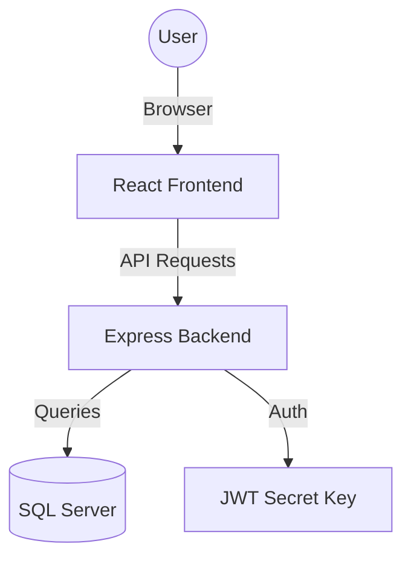

# ByteBalance: Smart Meal Planner - Project Documentation

## 1. Project Overview
ByteBalance is a comprehensive health and nutrition management application designed to help users track their dietary habits, plan meals, and achieve their health goals. It features a robust authentication system, interactive dashboards, and administrative tools for content management.

### Key Objectives:
- Provide personalized nutrition tracking based on user profiles.
- Enable efficient meal planning and food search.
- Offer data-driven insights through visual dashboards.
- Support administrative control over users and system settings.

---

## 2. Technical Architecture

### 2.1 Technology Stack
| Layer | Technology | Purpose |
| :--- | :--- | :--- |
| **Frontend** | React (v19) | Component-based UI development |
| **Routing** | React Router (v7) | Navigation and route management |
| **Styling** | Bootstrap, Vanilla CSS | Responsive design and custom aesthetics |
| **Animations** | Framer Motion, Three.js | High-end visual effects and transitions |
| **Backend** | Node.js, Express | Server-side logic and RESTful API |
| **Database** | MS SQL Server | Relational data storage |
| **Auth** | JWT (JSON Web Tokens) | Secure, stateless authentication |
| **Security** | bcryptjs | Secure password hashing |

### 2.2 System Diagram

---

## 3. Frontend Documentation

### 3.1 Core Pages & Features
| Page | File | Description |
| :--- | :--- | :--- |
| **Auth Page** | `AuthPage.jsx` | Unified login/register with Admin toggle and 2FA support. |
| **Dashboard** | `Dashboard.jsx` | Visual summary of nutrition, goals, and recent activities. |
| **Meal Planner** | `MealPlanner.jsx` | Daily meal planning interface (Breakfast, Lunch, Dinner, Snacks). |
| **Food Search** | `FoodSearch.jsx` | Integration with food database to add items to plans. |
| **Nutrition Summary**| `NutritionSummary.jsx` | Detailed breakdown of macros and daily caloric intake. |
| **Admin Portal** | `AdminDashboard.jsx` | User management, article management, and system settings. |
| **Profile** | `Profile.jsx` | Personal data management (Weight, Height, Age, Goal). |
| **Settings** | `Settings.jsx` | Account settings and security preferences. |

### 3.2 Visual Components
- **Background Effects**: Uses `ThreeBackground` and `BackgroundOrbs` for an immersive UI experience.
- **Charts**: Interactive data visualization using `recharts`.
- **Icons**: Sleek iconography provided by `lucide-react`.

---

## 4. Backend Documentation

### 4.1 API Routing Structure
- `/api/auth`: Handles registration, user/admin login, and verification code checks.
- `/api/user`: Profile management and user-specific data retrieval.
- `/api/foods`: Food database operations (Search, Add, List).
- `/api/mealplan`: Core logic for creating and retrieving daily meal plans.
- `/api/saved-plans`: Functionality to save and reuse favorite meal plans.
- `/api/admin`: Restricted endpoints for managing the system and users.

### 4.2 Database Connection
The backend connects to SQL Server using the `mssql/msnodesqlv8` driver, supporting Windows Authentication for secure local development.

---

## 5. Authentication Flow

### 5.1 User Registration
1. User provides Username, Email, and Password.
2. Password is hashed using `bcrypt` (10 salts).
3. User record is created in the `Users` table with the default `USER` role.

### 5.2 Common Login
- Users log in with Email/Password.
- Server verifies hash and returns a signed JWT.

### 5.3 Admin Login (Enhanced Security)
1. Admin logs in with credentials.
2. Server detects `ADMIN` role and generates a temporary **Passkey** (`ADMIN789`).
3. Frontend prompts for the passkey (2FA step).
4. After verification, a privileged JWT is issued.

---

## 6. Database Schema
| Table | Description |
| :--- | :--- |
| **Users** | Core account data, roles, and verification codes. |
| **UserProfiles** | Physical metrics (Weight, Height) and health goals. |
| **FoodItems** | Nutritional data for individual food entries. |
| **MealPlans** | Maps users to specific dates for planning. |
| **MealPlanFoods** | Junction table linking meals, foods, and quantities. |
| **SystemSettings** | Global configurations (e.g., Admin Registration Code). |

---

## 7. Setup & Installation
For a full guide on setting up the project locally, including SQL Server configuration and ODBC Driver requirements, please refer to the **[Setup Guide](setup_guide.md)**.
